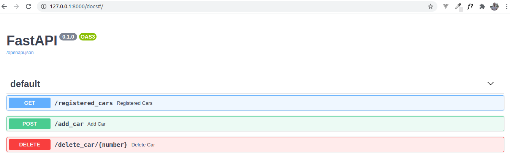

# test-car-numbers

#### SUMMARY

- This app allows you to create a registration number for a specific car.
- The registration number looks like this: 'AAA-002' - three capital letters a dash and three numbers.
- Each registration number must be unique.
- Once a registration number is assigned to a car it cannot be changed.
- More details in app/tasks.md


#### HOW TO RUN THE APP

With pipenv

- `git clone https://github.com/ClimenteA/test-car-numbers.git`
- `cd test-car-numbers/app`
- `pipenv shell`
- `pipenv install`
- `uvicorn main:app`

or with Docker

After you clonned this repository 
- `cd test-car-numbers`
- `docker build -t fastapi .`

Docker will create the container
```
.
.
.
Successfully built 1a1ee9dc4076
Successfully tagged fastapi:latest
```

Start the server: 
- `docker run -d --name 1a1ee9dc4076 -p 80:80 fastapi`

Make sure to replace 1a1ee9dc4076 with your id from previous command.
- `1a1ee9dc4076` is the container id 
- `fastapi` is the name we've given to the container when we built it.
 
Now go to your browser at address: 
- `http://127.0.0.1/docs`

#### API

- GET `/registered_cars` - see all registered cars
- POST `/add_car` - add a car number
- DELETE `/delete_car/{car_number}` - delete car number from registered cars

#### CURL/URL

Registered cars
- `curl -X GET "http://127.0.0.1/registered_cars" -H  "accept: application/json"`
- `http://127.0.0.1/registered_cars`


Add car
- `curl -X POST "http://127.0.0.1/add_car?number=ASD-321" -H  "accept: application/json" -d ""`
- `http://127.0.0.1/add_car?number=ASD-321`


Delete car
- `curl -X DELETE "http://127.0.0.1/delete_car/ASD-321" -H  "accept: application/json"`
- `http://127.0.0.1/delete_car/ASD-321`


## DEPENDENCIES
fastapi, uvicorn




